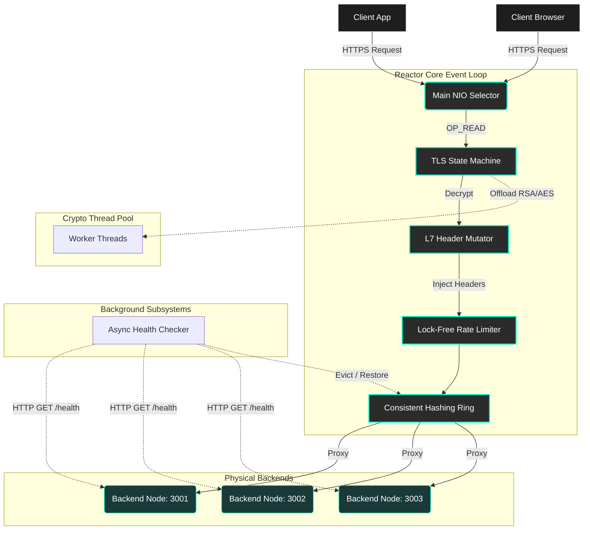

# 🚀 High-Performance Layer 7 Java Load Balancer


A fully asynchronous, non-blocking Layer 7 HTTP/HTTPS reverse proxy and load balancer built entirely from scratch in raw Java. 

This project intentionally avoids heavy web frameworks (like Spring Boot) and third-party libraries (like Netty or Jackson) to demonstrate a deep, ground-up understanding of low-level socket programming, memory management, thread-safety, and distributed systems architecture.

---

## ✨ Core Features

*   ⚡ **Event-Driven Reactor Pattern:** Utilizes Java NIO (`Selector`, `SocketChannel`) to multiplex thousands of concurrent connections on a single thread, bypassing the memory-heavy Thread-Per-Connection anti-pattern.
*   🔒 **Edge TLS/SSL Termination:** A custom cryptographic state machine leveraging `SSLEngine` to decrypt incoming HTTPS traffic at the proxy edge. RSA/AES handshakes are offloaded to a separate worker thread pool to prevent blocking the main event loop.
*   🔄 **Consistent Hashing with Virtual Nodes:** A `TreeMap`-based dynamic routing ring that ensures mathematically uniform traffic distribution (O(log N) lookups), guarded by a `ReentrantReadWriteLock` for massive read-concurrency.
*   🚦 **Lock-Free Rate Limiting:** A custom Token Bucket algorithm using `ConcurrentHashMap` and `AtomicReference` Compare-And-Swap (CAS) loops, capable of processing rate-limit checks in <1ms without synchronization bottlenecks.
*   🏥 **Active Health Checking:** An asynchronous background polling subsystem utilizing `CompletableFuture`. Dead nodes are instantaneously evicted from the routing ring and seamlessly restored upon recovery.
*   📝 **Layer 7 Header Mutation:** Dynamically intercepts and mutates raw byte streams to inject distributed tracing headers (`X-Forwarded-For`, `X-Real-IP`, `X-Forwarded-Proto`).

---

## 🏗️ Architecture Flow



---

## 🚀 Getting Started

### 1. Prerequisites
*   Java Development Kit (JDK) 17 or higher.
*   Apache JMeter (optional, for load testing).

### 2. Configuration
The proxy is configured via `config.json` in the root directory. It features a custom regex-based parser (no Gson/Jackson required).
```json
{
  "listeningPort": 443,
  "rateLimitCapacity": 100,
  "rateLimitRefillPerSecond": 10
}
```

### 3. Build & Run
Compile the source code using the `src` directory as the source path:
```bash
javac -sourcepath src src/Main.java
```

Start the Load Balancer:
```bash
java -cp src Main
```

---

## 📊 Performance Benchmarks
This architecture has been load-tested locally using **Apache JMeter**.

*   **Throughput:** Sustained **1,000+ Requests Per Second (RPS)** (Extrapolated capacity of 3.6 Million requests per hour on a single machine).
*   **Concurrency:** Handled **100 fully active, encrypted concurrent connections** seamlessly.
*   **Stability:** Achieved a **0% internal failure rate** with zero memory leaks during maximum pressure tests, proving the thread-safety of the custom lock-free structures.

To replicate the load test, open the provided `LoadTest_1k_RPS.jmx` file in Apache JMeter and hit Start.

---
*Designed and engineered from the ground up to demonstrate mastery of low-level Java networking and high-concurrency design patterns.*
